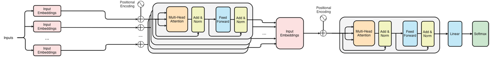
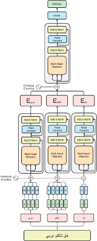

# 🧠 GLAB: Separated-Attention Mechanism

## 📌 Introduction

Tokenization techniques have rapidly evolved to assist Large Language Models (LLMs) [1], [2].These advancements stand on groundwork by [3] in The Transformation, Analysis, and Retrieval of Information by Computer for splitting text based on whitespace and punctuation, which was subsequently addressed by [4] in decent manner. Tokenization encountered significant advance with the introduction of NMTs by , which assisted in forming meaningful chunks of words. The emergence of reconstructable and learnable tokenizers such as SentencePiece [5], which segment sentences into pieces, learned to tokenize text. As an example, consider compounds such as “RiyadhCity is large”, which are segmented as “_Riyadh”, “City”, “_is”, and “_large”, where the slashes mark a learned space boundary.
Following the release of BERT [1], which stands for Bidirectional Encoder Representations from Transformers. Throughout introduction the WordPiece tokenizer has been empowered [5], a likelihood based subword selection method, which chose the subword based on the impact on a language model’s probability, and the continuation marker “##” provides the model these segments follow the previous piece. As an illustration, consider a sentence like “internationalization”, which can be segmented as “inter”, “##nation”, “##al”, and “ization”. These advancements guide toward GPT-2 [6], a byte level BPE tokenizer [7], which can work across all languages. For instance, consider a word like “café123”, which will be segmented as “__caf”, “é”, and “123”. This manner of tokenization allowed the field to thrive rapidly.
These tokenizers are robust for affixation based languages such as English, French, Spanish, German, Swedish, Norwegian, Danish, and Italian. However, root-based languages such as Arabic, Hebrew, and Aramaic, are difficult to explore for semantic meanings due to massive vocabulary size, morphological complexity, and orthographic variations. As an illustration, Arabic has over 12 million words, stemming out of a root-base system where one root can have a massive number of words. As an example, consider a word such as write (ktb), which can produce wrote (kataba), book (kitab), katib (writer), and desk (maktab). Consequently, the fragile tokenization techniques used to generate meaningful chunks turn out to be a pivotal factor of Large Language Models (LLMs) degradation for root-base languages.

In this work we propose the “GLAB Separated-Attention Mechanism”, a tokenization method base on BERT that consists of separated two BERTs characters-to-word and words-to-sentence embeddings, allowing the encoder to obtain semantics of these words, and trains the model on word embeddings instead of characters, which will makes the training faster. 

## 🚨 Problem

Standard tokenizers such as BPE and WordPiece work well for affix-based languages, but they are less effective for root-based languages such as Arabic. This leads to:

- Excessive token fragmentation
- Longer token sequences
- Higher computational cost
- Weaker semantic representation

Arabic contains more than 12 million words derived from root-based patterns.

## 💡 Solution

GLAB uses two encoders:

- Characters-to-Word Encoder
- Words-to-Sentence Encoder

## 🏗️ Architecture

Characters → Character Encoder → Word Embeddings → Context Encoder → Sentence Representation

## 🔤 Tokenization

| Token | Purpose |
|------|---------|
| [CLS] | Sentence representation |
| [SEP] | Separator |
| [UNK] | Unknown |
| [PAD] | Padding |
| [MASK] | Mask |

## 🔄 Architecture

## 🚀 Key Contributions

- Character-to-sequence tokenization
- Arabic-specific design
- Efficient representation

## 👥 Authors

- Mohammed S. Alziyad  
- Abdullah E. Alsuwaidan  

Supervisor: Dr. Mohammed Alfaki

## 📜 License

MIT License
